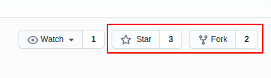
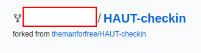
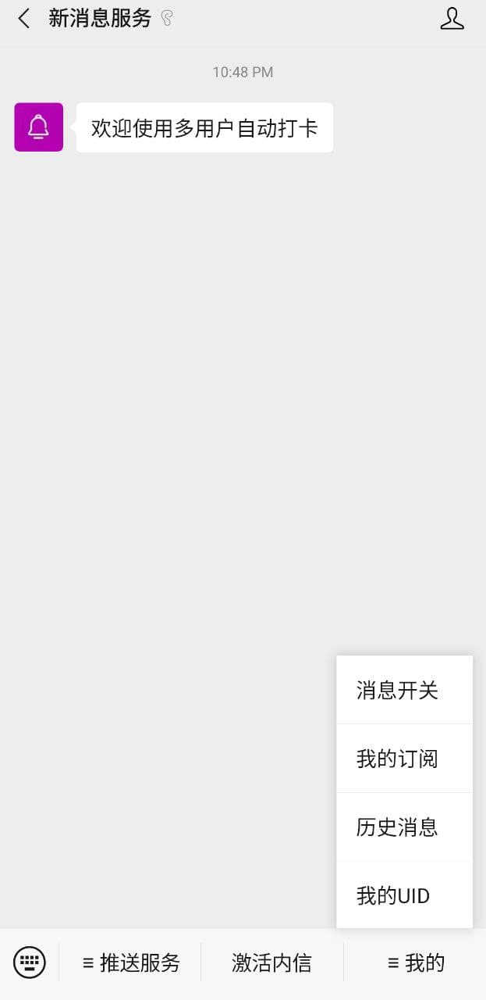
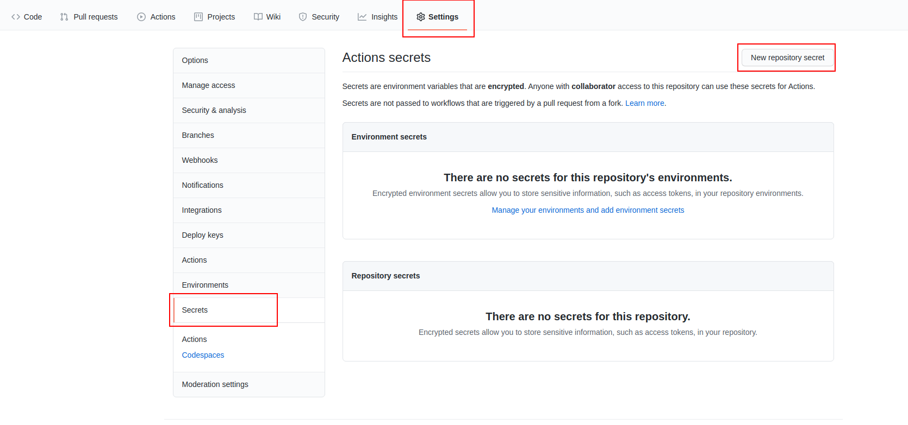
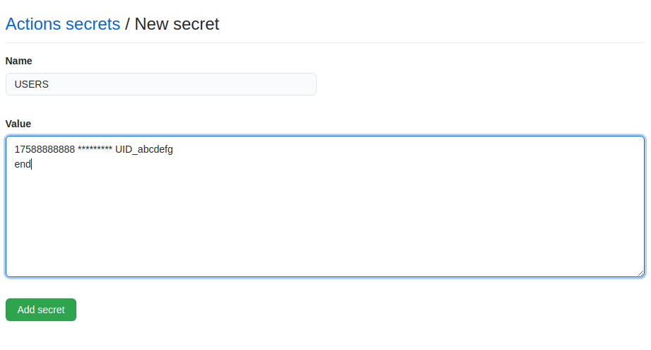
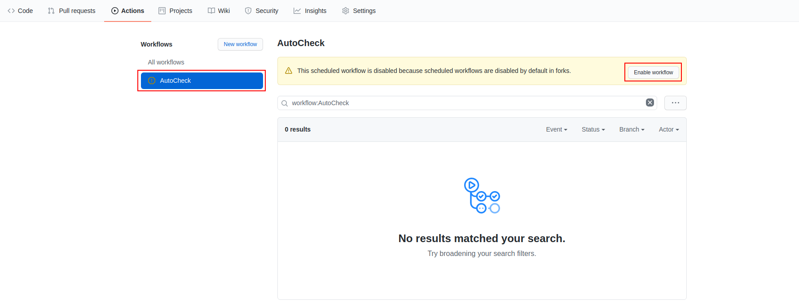
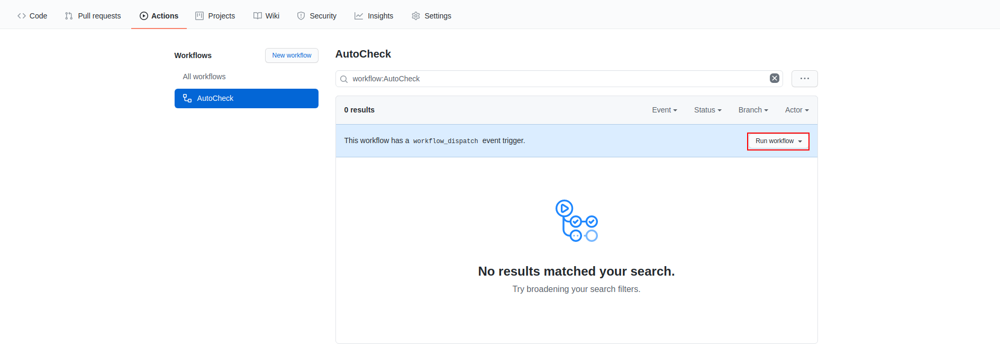

# HAUT-checkin
河南工业大学自动校外打卡，基于github Actions免服务器运行

- 多人打卡
- 使用简单，仅需账号密码以及用于微信推送的uid
- 自动获取上一次打卡信息用于打卡
- 向所有成员微信单独推送打卡状态 
- 完美校园服务器繁忙时造成打卡失败会自动重新打卡，直到所有成员成功打卡

## 更新日志

2021.1.10 添加手动运行按钮，重写使用方法，添加截图便于操作

2021.1.9 基于[原校内打卡脚本](https://github.com/themanforfree/EzCheckInSchool-MultiUser)修改,第一版校外打卡脚本发布


## 使用方法  

首先，点击页面右上角的`Star`并`Fork`



完成后左上角处的用户ID会变成你账号的ID



然后点击此链接获取二维码

[QRcode](http://wxpusher.zjiecode.com/api/qrcode/1men6ZnAtqckyldYHDbYfOKSsqcxxhXtu6nXChdP9iybdir048fJ1VxU0W5Kwlgo.jpg)

每个用户都需要扫描此二维码关注新消息服务公众号

然后依次点击`我的`->`我的UID`，获取每个用户的UID



接下来你需要设置`Secert`添加打卡成员的信息，在你Fork的项目中按以下步骤操作
 
`Settings`->`Secert`->`New repository secert`



在 Name 处填入`USERS`

在 Value 处按以下格式填入数据

每个打卡成员占一行，个数不限

在最后一行输入end


|Name|Value|example|
| :-----| :---- | :---- |
|`USERS`|`账号 密码 uid`|`17538141234 xxxxxxxxx UID_abcdefgh`|

最后提交的信息如下

```
17588888888 ********* UID_abcdefgh
end
```

如有多个成员，提交信息如下

```
17588888888 ********* UID_abcdefgh
......
17588888888 ********* UID_ijklmnop
end
```


然后按以下操作启用github actions

`Fork的项目主页`->`Actions`->`I understand...` 开启Actions


此时workflow可能默认为禁用状态，点击`AutoCheck`->`Enable workflow`启用



至此脚本部署完成，在未到打卡时间时你可以手动运行脚本用于测试，在下图位置点击`run workflow`即可



**由于github actions存在明显延迟，默认设置于每日每日凌晨00:00打卡**

**注意：本项目默认学校为河南工业大学，其他学校请自行修改代码。**


## 友情链接

https://github.com/themanforfree/EzCheckInSchool-MultiUser - 校内打卡

https://github.com/zhongbr/wanmei_campus - 完美校园模拟登录


